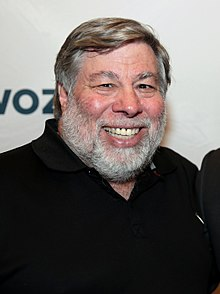

<h2>10 Computer Scientists Who Made History </h2>
<ul>
<li><strong>Alan Turing</strong></li>
</ul>

<strong></strong>

&nbsp;

<strong>Alan Mathison Turing</strong> <a class="mw-redirect" title="Officer of the Order of the British Empire" href="https://en.wikipedia.org/wiki/Officer_of_the_Order_of_the_British_Empire">OBE</a> <a title="Fellow of the Royal Society" href="https://en.wikipedia.org/wiki/Fellow_of_the_Royal_Society">FRS</a> (<a title="Help:IPA/English" href="https://en.wikipedia.org/wiki/Help:IPA/English">/ˈtjʊərɪŋ/</a>; 23 June 1912 &ndash; 7 June 1954) was an English mathematician, <a title="Computer scientist" href="https://en.wikipedia.org/wiki/Computer_scientist">computer scientist</a>,&nbsp;<a title="Logic" href="https://en.wikipedia.org/wiki/Logic">logician</a>, <a title="Cryptanalysis" href="https://en.wikipedia.org/wiki/Cryptanalysis">cryptanalyst</a>, philosopher, and&nbsp;<a title="Mathematical and theoretical biology" href="https://en.wikipedia.org/wiki/Mathematical_and_theoretical_biology">theoretical biologist</a>.&nbsp;Turing was highly influential in the development of&nbsp;<a title="Theoretical computer science" href="https://en.wikipedia.org/wiki/Theoretical_computer_science">theoretical computer science</a>, providing a formalisation of the concepts of&nbsp;<a title="Algorithm" href="https://en.wikipedia.org/wiki/Algorithm">algorithm</a>&nbsp;and&nbsp;<a title="Computation" href="https://en.wikipedia.org/wiki/Computation">computation</a>&nbsp;with the&nbsp;<a title="Turing machine" href="https://en.wikipedia.org/wiki/Turing_machine">Turing machine</a>, which can be considered a model of a&nbsp;<a class="mw-redirect" title="General-purpose computer" href="https://en.wikipedia.org/wiki/General-purpose_computer">general-purpose computer</a>.&nbsp;Turing is widely considered to be the father of theoretical computer science and&nbsp;<a title="Artificial intelligence" href="https://en.wikipedia.org/wiki/Artificial_intelligence">artificial intelligence</a>.&nbsp;Despite these accomplishments, he was never fully recognised in his home country during his lifetime due to the prevalence of&nbsp;<a title="Homophobia" href="https://en.wikipedia.org/wiki/Homophobia">homophobia</a>&nbsp;<a title="Timeline of LGBT history in the United Kingdom" href="https://en.wikipedia.org/wiki/Timeline_of_LGBT_history_in_the_United_Kingdom#20th_century">at the time</a>&nbsp;and because much of his work was covered by the&nbsp;<a title="Official Secrets Act" href="https://en.wikipedia.org/wiki/Official_Secrets_Act">Official Secrets Act</a>.

During the&nbsp;<a class="mw-redirect" title="Second World War" href="https://en.wikipedia.org/wiki/Second_World_War">Second World War</a>, Turing worked for the&nbsp;<a class="mw-redirect" title="Government Communications Headquarters" href="https://en.wikipedia.org/wiki/Government_Communications_Headquarters#Government_Code_and_Cypher_School_(GC&amp;CS)">Government Code and Cypher School</a>&nbsp;(GC&amp;CS) at&nbsp;<a title="Bletchley Park" href="https://en.wikipedia.org/wiki/Bletchley_Park">Bletchley Park</a>, Britain's&nbsp;<a title="Cryptanalysis" href="https://en.wikipedia.org/wiki/Cryptanalysis">codebreaking</a>&nbsp;centre that produced&nbsp;<a title="Ultra" href="https://en.wikipedia.org/wiki/Ultra">Ultra</a>&nbsp;intelligence. For a time he led&nbsp;<a title="Hut 8" href="https://en.wikipedia.org/wiki/Hut_8">Hut 8</a>, the section that was responsible for German naval cryptanalysis. Here, he devised a number of techniques for speeding the breaking of German&nbsp;<a title="Cipher" href="https://en.wikipedia.org/wiki/Cipher">ciphers</a>, including improvements to the pre-war Polish&nbsp;<a title="Bomba (cryptography)" href="https://en.wikipedia.org/wiki/Bomba_(cryptography)">bombe</a>&nbsp;method, an&nbsp;<a title="Electromechanics" href="https://en.wikipedia.org/wiki/Electromechanics">electromechanical</a>&nbsp;machine that could find settings for the&nbsp;<a title="Enigma machine" href="https://en.wikipedia.org/wiki/Enigma_machine">Enigma machine</a>.

Turing played a crucial role in cracking intercepted coded messages that enabled the Allies to defeat the Nazis in many crucial engagements, including the&nbsp;<a title="Battle of the Atlantic" href="https://en.wikipedia.org/wiki/Battle_of_the_Atlantic">Battle of the Atlantic</a>, and in so doing helped win the war. Due to the problems of&nbsp;<a title="Counterfactual history" href="https://en.wikipedia.org/wiki/Counterfactual_history">counterfactual history</a>, it is hard to estimate the precise effect Ultra intelligence had on the war,&nbsp;but at the upper end it has been estimated that this work shortened the war in Europe by more than two years and saved over 14&nbsp;million lives.

After the war Turing worked at the&nbsp;<a class="mw-redirect" title="National Physical Laboratory, UK" href="https://en.wikipedia.org/wiki/National_Physical_Laboratory,_UK">National Physical Laboratory</a>, where he designed the&nbsp;<a title="Automatic Computing Engine" href="https://en.wikipedia.org/wiki/Automatic_Computing_Engine">Automatic Computing Engine</a>. The Automatic Computing Engine was one of the first designs for a stored-program computer. In 1948, Turing joined&nbsp;<a title="Max Newman" href="https://en.wikipedia.org/wiki/Max_Newman">Max Newman</a>'s&nbsp;<a title="Computing Machine Laboratory" href="https://en.wikipedia.org/wiki/Computing_Machine_Laboratory">Computing Machine Laboratory</a>, at the&nbsp;<a title="Victoria University of Manchester" href="https://en.wikipedia.org/wiki/Victoria_University_of_Manchester">Victoria University of Manchester</a>, where he helped develop the&nbsp;<a title="Manchester computers" href="https://en.wikipedia.org/wiki/Manchester_computers">Manchester computers</a>&nbsp;and became interested in&nbsp;<a class="mw-redirect" title="Mathematical biology" href="https://en.wikipedia.org/wiki/Mathematical_biology">mathematical biology</a>. He wrote a paper on the chemical basis of&nbsp;<a title="Morphogenesis" href="https://en.wikipedia.org/wiki/Morphogenesis">morphogenesis</a>&nbsp;and predicted&nbsp;<a title="Chemical clock" href="https://en.wikipedia.org/wiki/Chemical_clock">oscillating</a>&nbsp;<a title="Chemical reaction" href="https://en.wikipedia.org/wiki/Chemical_reaction">chemical reactions</a>&nbsp;such as the&nbsp;<a title="Belousov&ndash;Zhabotinsky reaction" href="https://en.wikipedia.org/wiki/Belousov%E2%80%93Zhabotinsky_reaction">Belousov&ndash;Zhabotinsky reaction</a>, first observed in the 1960s.

Turing was prosecuted in 1952 for homosexual acts; the&nbsp;<a title="Labouchere Amendment" href="https://en.wikipedia.org/wiki/Labouchere_Amendment">Labouchere Amendment</a>&nbsp;of 1885 had mandated that "gross indecency" was a criminal offence in the UK. He accepted&nbsp;<a title="Chemical castration" href="https://en.wikipedia.org/wiki/Chemical_castration">chemical castration</a>&nbsp;treatment, with&nbsp;<a title="Diethylstilbestrol" href="https://en.wikipedia.org/wiki/Diethylstilbestrol">DES</a>, as an alternative to prison. Turing died in 1954, 16 days before his 42nd birthday, from&nbsp;<a title="Cyanide poisoning" href="https://en.wikipedia.org/wiki/Cyanide_poisoning">cyanide poisoning</a>. An inquest determined his death as a suicide, but it has been noted that the known evidence is also consistent with accidental poisoning.

In 2009, following an&nbsp;<a class="mw-redirect" title="Internet campaign" href="https://en.wikipedia.org/wiki/Internet_campaign">Internet campaign</a>, British Prime Minister&nbsp;<a title="Gordon Brown" href="https://en.wikipedia.org/wiki/Gordon_Brown">Gordon Brown</a>&nbsp;made an&nbsp;<a href="https://en.wikipedia.org/wiki/Alan_Turing#Government_apology_and_pardon_support">official public apology</a>&nbsp;on behalf of the British government for "the appalling way he was treated".&nbsp;<a class="mw-redirect" title="Queen Elizabeth II" href="https://en.wikipedia.org/wiki/Queen_Elizabeth_II">Queen Elizabeth II</a>&nbsp;granted Turing a posthumous pardon in 2013. The "<a title="Alan Turing law" href="https://en.wikipedia.org/wiki/Alan_Turing_law">Alan Turing law</a>" is now an informal term for a 2017 law in the United Kingdom that retroactively pardoned men cautioned or convicted under historical legislation that outlawed homosexual acts.

&nbsp;

<ul>
<li><strong>Tim Berners-Lee</strong></li>
</ul>

<strong></strong>

<strong>Sir Timothy John Berners-Lee</strong>&nbsp;<a class="mw-redirect" title="Member of the Order of Merit" href="https://en.wikipedia.org/wiki/Member_of_the_Order_of_Merit">OM</a>&nbsp;<a class="mw-redirect" title="Knight Commander of the Order of the British Empire" href="https://en.wikipedia.org/wiki/Knight_Commander_of_the_Order_of_the_British_Empire">KBE</a>&nbsp;<a title="Fellow of the Royal Society" href="https://en.wikipedia.org/wiki/Fellow_of_the_Royal_Society">FRS</a>&nbsp;<a title="Fellow of the Royal Academy of Engineering" href="https://en.wikipedia.org/wiki/Fellow_of_the_Royal_Academy_of_Engineering">FREng</a>&nbsp;<a title="Fellow of the Royal Society of Arts" href="https://en.wikipedia.org/wiki/Fellow_of_the_Royal_Society_of_Arts">FRSA</a>&nbsp;<a class="mw-redirect" title="Fellow of the British Computer Society" href="https://en.wikipedia.org/wiki/Fellow_of_the_British_Computer_Society">FBCS</a>&nbsp;(born 8 June 1955),&nbsp;also known as&nbsp;<strong>TimBL</strong>, is an English computer scientist best known as the inventor of the&nbsp;<a title="World Wide Web" href="https://en.wikipedia.org/wiki/World_Wide_Web">World Wide Web</a>. He is a&nbsp;<a title="Research fellow" href="https://en.wikipedia.org/wiki/Research_fellow">Professorial Fellow</a>&nbsp;of Computer Science at the&nbsp;<a title="University of Oxford" href="https://en.wikipedia.org/wiki/University_of_Oxford">University of Oxford</a>&nbsp;and a professor at the&nbsp;<a title="Massachusetts Institute of Technology" href="https://en.wikipedia.org/wiki/Massachusetts_Institute_of_Technology">Massachusetts Institute of Technology</a>&nbsp;(MIT).&nbsp;Berners-Lee proposed an information management system on 12 March 1989,&nbsp;then implemented the first successful communication between a&nbsp;<a title="Hypertext Transfer Protocol" href="https://en.wikipedia.org/wiki/Hypertext_Transfer_Protocol">Hypertext Transfer Protocol (HTTP)</a>&nbsp;client and&nbsp;<a title="Server (computing)" href="https://en.wikipedia.org/wiki/Server_(computing)">server</a>&nbsp;via the&nbsp;<a title="Internet" href="https://en.wikipedia.org/wiki/Internet">internet</a>&nbsp;in mid-November.

Berners-Lee is the director of the&nbsp;<a title="World Wide Web Consortium" href="https://en.wikipedia.org/wiki/World_Wide_Web_Consortium">World Wide Web Consortium</a>&nbsp;(W3C) which oversees the continued development of the Web. He is also the founder of the&nbsp;<a title="World Wide Web Foundation" href="https://en.wikipedia.org/wiki/World_Wide_Web_Foundation">World Wide Web Foundation</a>&nbsp;and is a senior researcher and holder of the 3Com founders chair at the&nbsp;<a title="MIT Computer Science and Artificial Intelligence Laboratory" href="https://en.wikipedia.org/wiki/MIT_Computer_Science_and_Artificial_Intelligence_Laboratory">MIT Computer Science and Artificial Intelligence Laboratory</a>&nbsp;(CSAIL).&nbsp;He is a director of the&nbsp;<a class="mw-redirect" title="Web Science Research Initiative" href="https://en.wikipedia.org/wiki/Web_Science_Research_Initiative">Web Science Research Initiative</a>&nbsp;(WSRI)&nbsp;and a member of the advisory board of the&nbsp;<a title="MIT Center for Collective Intelligence" href="https://en.wikipedia.org/wiki/MIT_Center_for_Collective_Intelligence">MIT Center for Collective Intelligence</a>.&nbsp;In 2011, he was named as a member of the board of&nbsp;<a title="Trustee" href="https://en.wikipedia.org/wiki/Trustee">trustees</a>&nbsp;of the&nbsp;<a title="Ford Foundation" href="https://en.wikipedia.org/wiki/Ford_Foundation">Ford Foundation</a>.&nbsp;He is a founder and president of the&nbsp;<a title="Open Data Institute" href="https://en.wikipedia.org/wiki/Open_Data_Institute">Open Data Institute</a>&nbsp;and is currently an advisor at social network&nbsp;<a class="mw-redirect" title="MeWe (social media)" href="https://en.wikipedia.org/wiki/MeWe_(social_media)">MeWe</a>.

In 2004, Berners-Lee was knighted by Queen&nbsp;<a title="Elizabeth II" href="https://en.wikipedia.org/wiki/Elizabeth_II">Elizabeth II</a>&nbsp;for his pioneering work.&nbsp;In April 2009, he was elected a&nbsp;<a class="mw-redirect" title="Foreign Associate of the National Academy of Sciences" href="https://en.wikipedia.org/wiki/Foreign_Associate_of_the_National_Academy_of_Sciences">Foreign Associate of the National Academy of Sciences</a>.&nbsp;He was named in&nbsp;<em>Time</em>&nbsp;magazine's list of the&nbsp;<a title="Time 100: The Most Important People of the Century" href="https://en.wikipedia.org/wiki/Time_100:_The_Most_Important_People_of_the_Century">100 Most Important People of the 20th century</a>&nbsp;and has received a&nbsp;<a class="mw-redirect" title="Awards and honours presented to Tim Berners-Lee" href="https://en.wikipedia.org/wiki/Awards_and_honours_presented_to_Tim_Berners-Lee">number of other accolades</a>&nbsp;for his invention.&nbsp;He was honoured as the "Inventor of the World Wide Web" during the 2012 Summer Olympics opening ceremony in which he appeared working with a vintage&nbsp;<a title="NeXT Computer" href="https://en.wikipedia.org/wiki/NeXT_Computer">NeXT Computer</a>&nbsp;at the&nbsp;<a class="mw-redirect" title="Olympic Stadium (London)" href="https://en.wikipedia.org/wiki/Olympic_Stadium_(London)">London Olympic Stadium</a>.&nbsp;He tweeted "This is for everyone"&nbsp;which appeared in LCD lights attached to the chairs of the audience.&nbsp;He received the 2016&nbsp;<a title="Turing Award" href="https://en.wikipedia.org/wiki/Turing_Award">Turing Award</a>&nbsp;"for inventing the World Wide Web, the first web browser, and the fundamental protocols and algorithms allowing the Web to scale".

 
<ul>
<li id="firstHeading" class="firstHeading" lang="en"><strong>John von Neumann</strong></li>
</ul>

<strong></strong>

<strong>John von Neumann</strong>&nbsp;(<a title="Help:IPA/English" href="https://en.wikipedia.org/wiki/Help:IPA/English">/vɒn&nbsp;ˈnɔɪmən/</a>;&nbsp;<a title="Hungarian language" href="https://en.wikipedia.org/wiki/Hungarian_language">Hungarian</a>:&nbsp;<em lang="hu">Neumann J&aacute;nos Lajos</em>,&nbsp;<small>pronounced&nbsp;</small><a title="Help:IPA/Hungarian" href="https://en.wikipedia.org/wiki/Help:IPA/Hungarian">[ˈnɒjmɒn ˈjaːnoʃ ˈlɒjoʃ]</a>; December 28, 1903&nbsp;&ndash; February&nbsp;8, 1957) was a Hungarian-American&nbsp;<a title="Mathematician" href="https://en.wikipedia.org/wiki/Mathematician">mathematician</a>,&nbsp;<a title="Physicist" href="https://en.wikipedia.org/wiki/Physicist">physicist</a>,&nbsp;<a title="Computer scientist" href="https://en.wikipedia.org/wiki/Computer_scientist">computer scientist</a>,&nbsp;<a title="Engineer" href="https://en.wikipedia.org/wiki/Engineer">engineer</a>&nbsp;and&nbsp;<a title="Polymath" href="https://en.wikipedia.org/wiki/Polymath">polymath</a>. Von Neumann was generally regarded as the foremost mathematician of his time&nbsp;and said to be "the last representative of the great mathematicians";&nbsp;he integrated&nbsp;<a title="Basic research" href="https://en.wikipedia.org/wiki/Basic_research">pure</a>&nbsp;and&nbsp;<a title="Applied science" href="https://en.wikipedia.org/wiki/Applied_science#Applied_research">applied sciences</a>.

Von Neumann made major contributions to many fields, including&nbsp;<a title="Mathematics" href="https://en.wikipedia.org/wiki/Mathematics">mathematics</a>&nbsp;(<a title="Foundations of mathematics" href="https://en.wikipedia.org/wiki/Foundations_of_mathematics">foundations of mathematics</a>,&nbsp;<a title="Functional analysis" href="https://en.wikipedia.org/wiki/Functional_analysis">functional analysis</a>,&nbsp;<a title="Ergodic theory" href="https://en.wikipedia.org/wiki/Ergodic_theory">ergodic theory</a>,&nbsp;<a title="Representation theory" href="https://en.wikipedia.org/wiki/Representation_theory">representation theory</a>,&nbsp;<a class="mw-redirect" title="Operator algebras" href="https://en.wikipedia.org/wiki/Operator_algebras">operator algebras</a>,&nbsp;<a title="Geometry" href="https://en.wikipedia.org/wiki/Geometry">geometry</a>,&nbsp;<a title="Topology" href="https://en.wikipedia.org/wiki/Topology">topology</a>, and&nbsp;<a title="Numerical analysis" href="https://en.wikipedia.org/wiki/Numerical_analysis">numerical analysis</a>),&nbsp;<a title="Physics" href="https://en.wikipedia.org/wiki/Physics">physics</a>&nbsp;(<a title="Quantum mechanics" href="https://en.wikipedia.org/wiki/Quantum_mechanics">quantum mechanics</a>,&nbsp;<a title="Fluid dynamics" href="https://en.wikipedia.org/wiki/Fluid_dynamics">hydrodynamics</a>, and&nbsp;<a title="Quantum statistical mechanics" href="https://en.wikipedia.org/wiki/Quantum_statistical_mechanics">quantum statistical mechanics</a>),&nbsp;<a title="Economics" href="https://en.wikipedia.org/wiki/Economics">economics</a>&nbsp;(<a title="Game theory" href="https://en.wikipedia.org/wiki/Game_theory">game theory</a>),&nbsp;<a title="Computing" href="https://en.wikipedia.org/wiki/Computing">computing</a>&nbsp;(<a title="Von Neumann architecture" href="https://en.wikipedia.org/wiki/Von_Neumann_architecture">Von Neumann architecture</a>,&nbsp;<a title="Linear programming" href="https://en.wikipedia.org/wiki/Linear_programming">linear programming</a>,&nbsp;<a title="Von Neumann universal constructor" href="https://en.wikipedia.org/wiki/Von_Neumann_universal_constructor">self-replicating machines</a>,&nbsp;<a title="Stochastic computing" href="https://en.wikipedia.org/wiki/Stochastic_computing">stochastic computing</a>), and&nbsp;<a title="Statistics" href="https://en.wikipedia.org/wiki/Statistics">statistics</a>.

He was a pioneer of the application of&nbsp;<a title="Operator theory" href="https://en.wikipedia.org/wiki/Operator_theory">operator theory</a>&nbsp;to quantum mechanics in the development of functional analysis, and a key figure in the development of&nbsp;<a title="Game theory" href="https://en.wikipedia.org/wiki/Game_theory">game theory</a>&nbsp;and the concepts of&nbsp;<a title="Cellular automaton" href="https://en.wikipedia.org/wiki/Cellular_automaton">cellular automata</a>, the&nbsp;<a title="Von Neumann universal constructor" href="https://en.wikipedia.org/wiki/Von_Neumann_universal_constructor">universal constructor</a>&nbsp;and the&nbsp;<a title="Computer" href="https://en.wikipedia.org/wiki/Computer">digital computer</a>.

Von Neumann published over 150 papers in his life: about 60 in pure mathematics, 60 in applied mathematics, 20 in physics, and the remainder on special mathematical subjects or non-mathematical ones.&nbsp;His last work, an unfinished manuscript written while he was in the hospital, was later published in book form as&nbsp;<em><a title="The Computer and the Brain" href="https://en.wikipedia.org/wiki/The_Computer_and_the_Brain">The Computer and the Brain</a></em>.

His analysis of the structure of&nbsp;<a title="Self-replication" href="https://en.wikipedia.org/wiki/Self-replication">self-replication</a>&nbsp;preceded the discovery of the structure of&nbsp;<a title="DNA" href="https://en.wikipedia.org/wiki/DNA">DNA</a>. In a short list of facts about his life he submitted to the&nbsp;<a title="National Academy of Sciences" href="https://en.wikipedia.org/wiki/National_Academy_of_Sciences">National Academy of Sciences</a>, he wrote, "The part of my work I consider most essential is that on quantum mechanics, which developed in G&ouml;ttingen in 1926, and subsequently in Berlin in 1927&ndash;1929. Also, my work on various forms of operator theory, Berlin 1930 and Princeton 1935&ndash;1939; on the ergodic theorem, Princeton, 1931&ndash;1932."

During&nbsp;<a title="World War II" href="https://en.wikipedia.org/wiki/World_War_II">World War II</a>, von Neumann worked on the&nbsp;<a title="Manhattan Project" href="https://en.wikipedia.org/wiki/Manhattan_Project">Manhattan Project</a>&nbsp;with theoretical physicist&nbsp;<a title="Edward Teller" href="https://en.wikipedia.org/wiki/Edward_Teller">Edward Teller</a>, mathematician&nbsp;<a title="Stanislaw Ulam" href="https://en.wikipedia.org/wiki/Stanislaw_Ulam">Stanislaw Ulam</a>&nbsp;and others, problem-solving key steps in the&nbsp;<a title="Nuclear physics" href="https://en.wikipedia.org/wiki/Nuclear_physics">nuclear physics</a>&nbsp;involved in&nbsp;<a title="Thermonuclear fusion" href="https://en.wikipedia.org/wiki/Thermonuclear_fusion">thermonuclear</a>&nbsp;reactions and the hydrogen bomb. He developed the mathematical models behind the&nbsp;<a title="Explosive lens" href="https://en.wikipedia.org/wiki/Explosive_lens">explosive lenses</a>&nbsp;used in the&nbsp;<a class="mw-redirect" title="Implosion-type nuclear weapon" href="https://en.wikipedia.org/wiki/Implosion-type_nuclear_weapon">implosion-type nuclear weapon</a>&nbsp;and coined the term "kiloton" (of&nbsp;<a title="TNT" href="https://en.wikipedia.org/wiki/TNT">TNT</a>) as a measure of the explosive force generated.

After the war, he served on the General Advisory Committee of the&nbsp;<a title="United States Atomic Energy Commission" href="https://en.wikipedia.org/wiki/United_States_Atomic_Energy_Commission">United States Atomic Energy Commission</a>, and consulted for a number of organizations, including the&nbsp;<a title="United States Air Force" href="https://en.wikipedia.org/wiki/United_States_Air_Force">United States Air Force</a>, the Army's&nbsp;<a title="Ballistic Research Laboratory" href="https://en.wikipedia.org/wiki/Ballistic_Research_Laboratory">Ballistic Research Laboratory</a>, the&nbsp;<a title="Armed Forces Special Weapons Project" href="https://en.wikipedia.org/wiki/Armed_Forces_Special_Weapons_Project">Armed Forces Special Weapons Project</a>, and the&nbsp;<a title="Lawrence Livermore National Laboratory" href="https://en.wikipedia.org/wiki/Lawrence_Livermore_National_Laboratory">Lawrence Livermore National Laboratory</a>. As a Hungarian &eacute;migr&eacute;, concerned that the Soviets would achieve nuclear superiority, he designed and promoted the policy of&nbsp;<a class="mw-redirect" title="Mutually assured destruction" href="https://en.wikipedia.org/wiki/Mutually_assured_destruction">mutually assured destruction</a>&nbsp;to limit the arms race.

 
<ul>
<li id="firstHeading" class="firstHeading" lang="en"><strong>Steve Wozniak</strong></li>
</ul>

<strong></strong>

<strong>Stephen Gary Wozniak</strong>&nbsp;(<a title="Help:IPA/English" href="https://en.wikipedia.org/wiki/Help:IPA/English">/ˈwɒzni&aelig;k/</a>; born August 11, 1950),&nbsp;also known by his nickname "<strong>Woz</strong>", is an American&nbsp;<a class="mw-redirect" title="" href="https://en.wikipedia.org/wiki/Electronics_engineer">electronics engineer</a>,&nbsp;<a title="Programmer" href="https://en.wikipedia.org/wiki/Programmer">programmer</a>,&nbsp;<a class="mw-redirect" title="Philanthropist" href="https://en.wikipedia.org/wiki/Philanthropist">philanthropist</a>, and&nbsp;<a title="Technology" href="https://en.wikipedia.org/wiki/Technology">technology</a>&nbsp;<a class="mw-redirect" title="Entrepreneur" href="https://en.wikipedia.org/wiki/Entrepreneur">entrepreneur</a>. In 1976, he co-founded&nbsp;<a title="Apple Inc." href="https://en.wikipedia.org/wiki/Apple_Inc.">Apple Inc.</a>, which later became the&nbsp;<a class="mw-redirect" title="List of the largest information technology companies" href="https://en.wikipedia.org/wiki/List_of_the_largest_information_technology_companies">world's largest information technology company</a>&nbsp;by revenue and the&nbsp;<a title="List of public corporations by market capitalization" href="https://en.wikipedia.org/wiki/List_of_public_corporations_by_market_capitalization">largest company in the world by market capitalization</a>. Through their work at Apple in the 1970s and 1980s, he and Apple co-founder&nbsp;<a title="Steve Jobs" href="https://en.wikipedia.org/wiki/Steve_Jobs">Steve Jobs</a>&nbsp;are widely recognized as two prominent pioneers of the&nbsp;<a title="History of personal computers" href="https://en.wikipedia.org/wiki/History_of_personal_computers">personal computer revolution</a>.

In 1975, Wozniak started developing the&nbsp;<a title="Apple I" href="https://en.wikipedia.org/wiki/Apple_I">Apple&nbsp;I</a>&nbsp;&nbsp;into the computer that launched Apple when he and Jobs first began marketing it the following year. He primarily designed the&nbsp;<a title="Apple II" href="https://en.wikipedia.org/wiki/Apple_II">Apple II</a>, introduced in 1977, known as one of the first highly successful mass-produced&nbsp;<a title="Microcomputer" href="https://en.wikipedia.org/wiki/Microcomputer">microcomputers</a>,&nbsp;while Jobs oversaw the development of its foam-molded plastic case and early Apple employee&nbsp;<a title="Rod Holt" href="https://en.wikipedia.org/wiki/Rod_Holt">Rod Holt</a>&nbsp;developed the&nbsp;<a title="Switched-mode power supply" href="https://en.wikipedia.org/wiki/Switched-mode_power_supply">switching power supply</a>.&nbsp;With software engineer&nbsp;<a title="Jef Raskin" href="https://en.wikipedia.org/wiki/Jef_Raskin">Jef Raskin</a>, Wozniak had a major influence over the initial development of the original&nbsp;<a title="Macintosh" href="https://en.wikipedia.org/wiki/Macintosh">Apple Macintosh</a>&nbsp;concepts from 1979 to 1981, when Jobs took over the project following Wozniak's brief departure from the company due to a traumatic airplane accident.&nbsp;After permanently leaving Apple in 1985, Wozniak founded&nbsp;<a title="CL 9" href="https://en.wikipedia.org/wiki/CL_9">CL 9</a>&nbsp;and created the first programmable&nbsp;<a title="Universal remote" href="https://en.wikipedia.org/wiki/Universal_remote">universal remote</a>, released in 1987. He then pursued several other businesses and philanthropic ventures throughout his career, focusing largely on technology in&nbsp;<a title="K&ndash;12" href="https://en.wikipedia.org/wiki/K%E2%80%9312">K&ndash;12</a>&nbsp;schools.

As of November 2019, Wozniak has remained an employee of Apple in a ceremonial capacity since stepping down in 1985.

 
